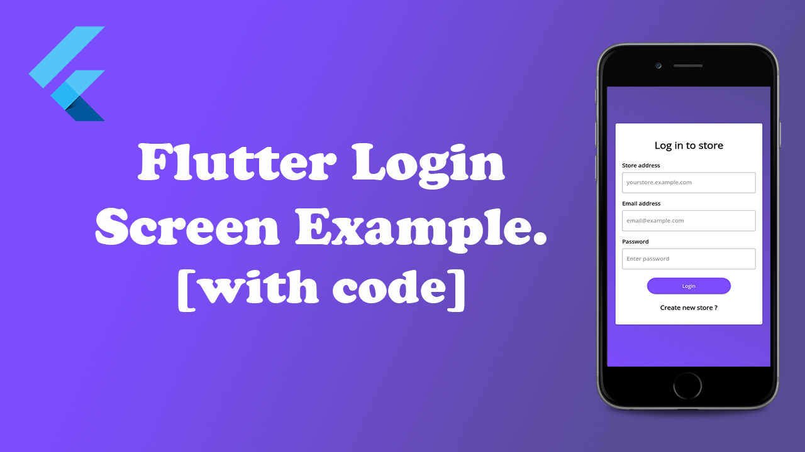

# Flutter Simple Login Screen Example #1

Youtube Video.

<iframe width="560" height="315" src="https://www.youtube.com/embed/BOjLTJ7VA1A" frameborder="0" allow="accelerometer; autoplay; encrypted-media; gyroscope; picture-in-picture" allowfullscreen></iframe>

 
## Screenshot

